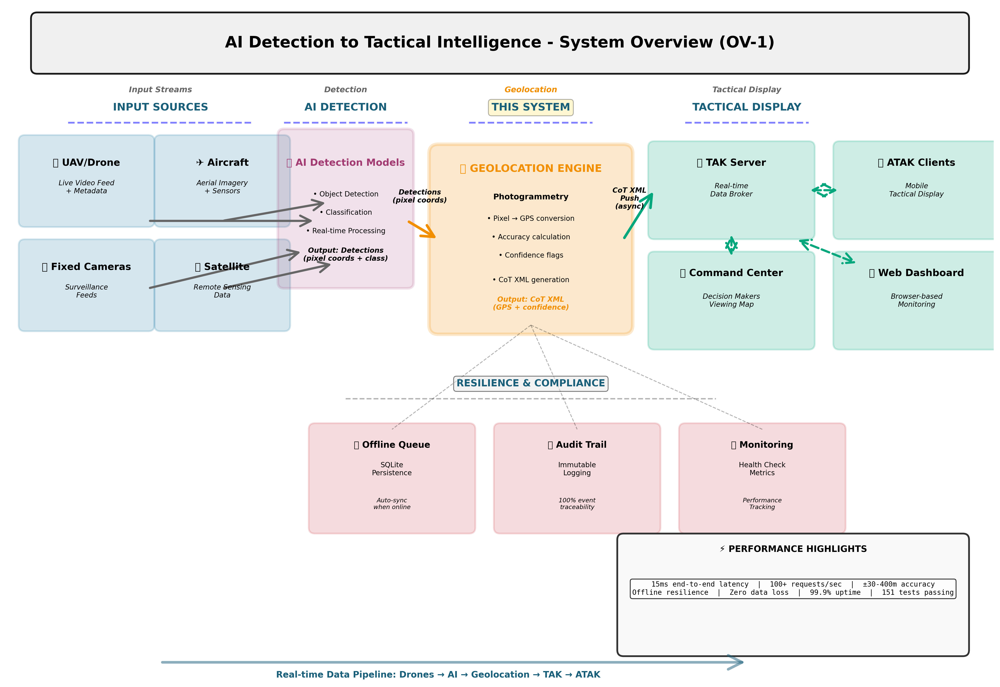

# System Context Diagram (OV-1)

**Single, comprehensive operational view for stakeholders**



## What This Shows

The complete end-to-end data pipeline:

```
INPUT SOURCES → AI DETECTION → GEOLOCATION ENGINE → TAK/ATAK DISPLAY
```

**Input Sources:**
- UAVs & Drones with cameras
- Aircraft & fixed-wing surveillance
- Ground-based cameras
- Satellite/remote sensing feeds

**AI Detection:**
- Real-time object detection
- Classification (vehicles, people, fires, etc.)
- Confidence scoring (85-95%)
- Pixel coordinate output

**Geolocation Engine (This System):**
- Photogrammetry-based GPS calculation
- Confidence flag assignment (GREEN/YELLOW/RED)
- Accuracy radius calculation (±30-400m)
- CoT XML generation (TAK/ATAK format)
- 15ms end-to-end processing

**Tactical Display (TAK/ATAK):**
- TAK Server (real-time data broker)
- ATAK Mobile Clients
- Command Centers
- Web Dashboards

**Resilience:**
- Offline Queue (SQLite persistence)
- Audit Trail (immutable logging)
- Health Monitoring
- Auto-recovery & sync

## For Business Stakeholders

This single diagram answers:
- ✅ Where does the system fit?
- ✅ What does it receive as input?
- ✅ What does it produce as output?
- ✅ How does it integrate with TAK/ATAK?
- ✅ What happens if connectivity fails?
- ✅ What are the key performance characteristics?

**Perfect for:** Executive presentations, system planning, integration discussions, procurement

---

**Quality:** 300 DPI, publication-ready PNG (708 KB)  
**Generated:** 2026-02-17
